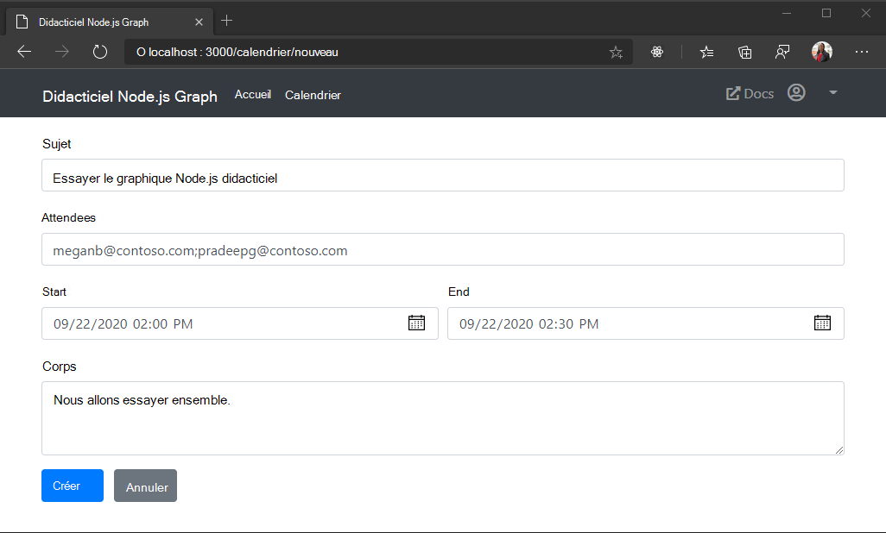

<!-- markdownlint-disable MD002 MD041 -->

Dans cette section, vous allez ajouter la possibilité de créer des événements dans le calendrier de l’utilisateur.In this section you will add the ability to create events on the user's calendar.

## Créer un formulaire d’événementCreate a new event form

1. Créez un fichier dans le répertoire **./views** nommé **NewEvent. BH** et ajoutez le code suivant.Create a new file in the **./views** directory named **newevent.hbs** and add the following code.

    :::code language="html" source="../demo/graph-tutorial/views/newevent.hbs" id="NewEventFormSnippet":::

1. Ajoutez le code suivant au fichier **calendar.js./routes/** avant la `module.exports = router;` ligne.Add the following code to the **./routes/calendar.js** file before the `module.exports = router;` line.

    :::code language="javascript" source="../demo/graph-tutorial/routes/calendar.js" id="GetEventFormSnippet":::

Cela implémente un formulaire pour l’entrée utilisateur et l’affiche.This implements a form for user input and renders it.

## Créer l’événementCreate the event

1. Ouvrez **./graph.js** et ajoutez la fonction suivante dans `module.exports` .Open **./graph.js** and add the following function inside `module.exports`.

    :::code language="javascript" source="../demo/graph-tutorial/graph.js" id="CreateEventSnippet":::

    Ce code utilise les champs de formulaire pour créer un objet d’événement Graph, puis envoie une requête POST au `/me/events` point de terminaison pour créer l’événement dans le calendrier par défaut de l’utilisateur.This code uses the form fields to create a Graph event object, then sends a POST request to the `/me/events` endpoint to create the event on the user's default calendar.

1. Ajoutez le code suivant au fichier **calendar.js./routes/** avant la `module.exports = router;` ligne.Add the following code to the **./routes/calendar.js** file before the `module.exports = router;` line.

    :::code language="javascript" source="../demo/graph-tutorial/routes/calendar.js" id="PostEventFormSnippet":::

    Ce code valide et nettoie l’entrée du formulaire, puis appelle `graph.createEvent` la création de l’événement.This code validates and sanitized the form input, then calls `graph.createEvent` to create the event. Il redirige vers l’affichage Calendrier une fois l’appel terminé.It redirects back to the calendar view after the call completes.

1. Enregistrez vos modifications, puis redémarrez l’application.Save your changes and restart the app. Cliquez sur l’élément de navigation **calendrier** , puis cliquez sur le bouton **créer un événement** .Click the **Calendar** nav item, then click the **Create event** button. Renseignez les valeurs et cliquez sur **créer**.Fill in the values and click **Create**. L’application revient à l’affichage Calendrier une fois que le nouvel événement est créé.The app returns to the calendar view once the new event is created.

    
